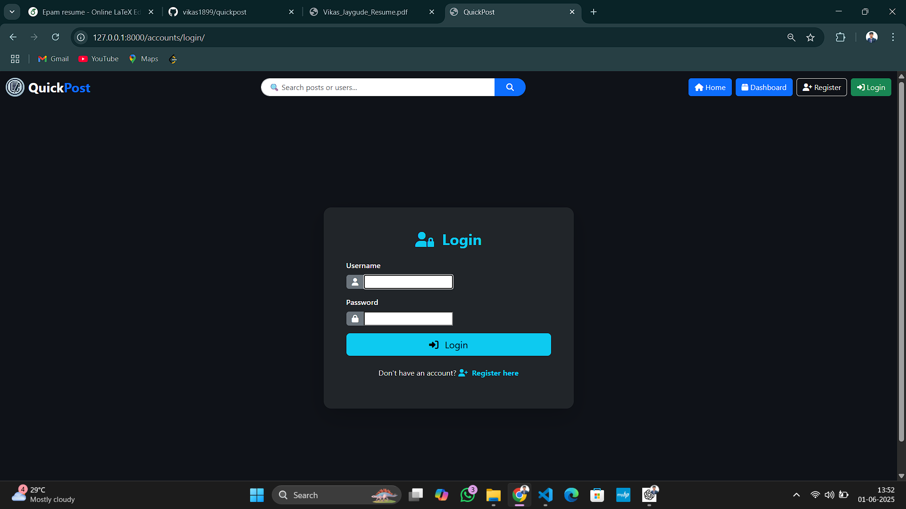
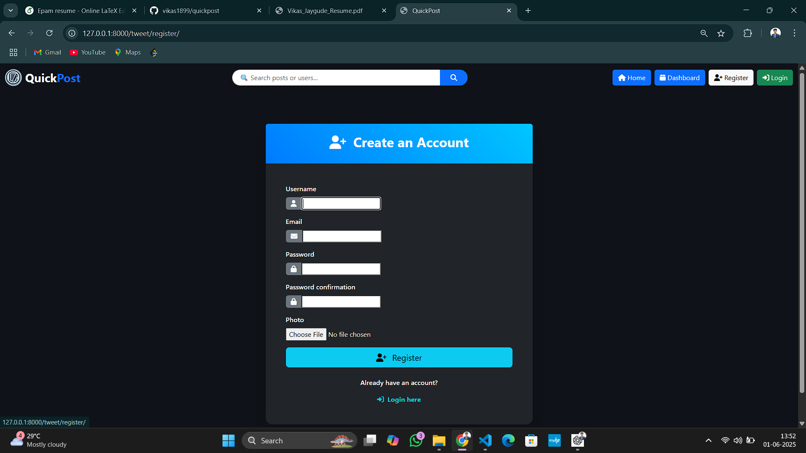
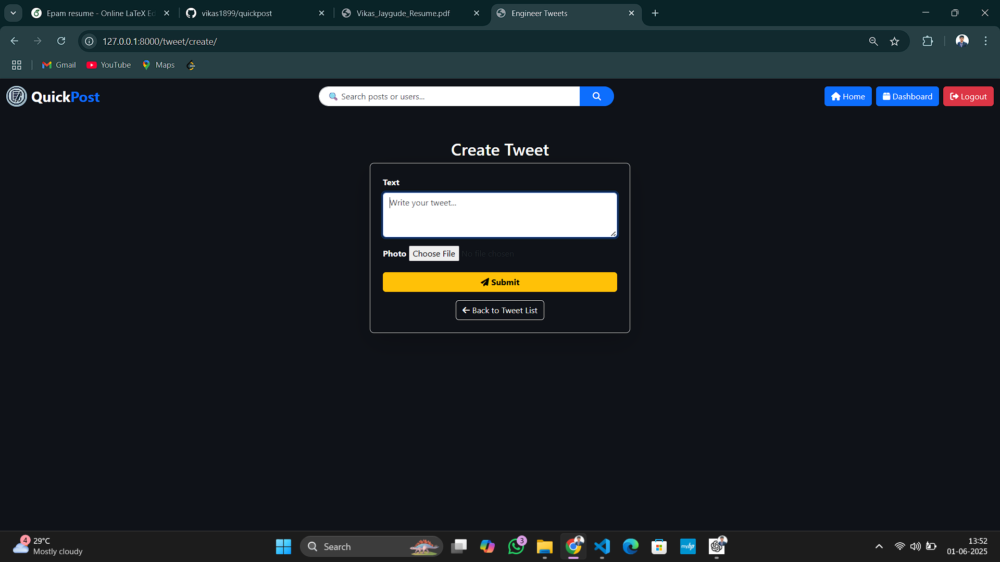

# QuickPost Web App

## 📖 Overview

QuickPost is a Django-based web application similar to Twitter, enabling users to create, read, update, and delete posts. It supports user authentication with login and registration, and features a responsive UI designed with Bootstrap for a smooth user experience.

---

## 🚀 Features

- User authentication (Login & Registration) using Django's built-in system
- Full CRUD (Create, Read, Update, Delete) for posts
- Responsive design with Bootstrap
- Admin panel for managing users and posts

---

## 🛠️ Technologies Used

- Python
- Django
- Bootstrap
- SQLite (default Django database)
- HTML, CSS

---

## 📷 Screenshots

### Login Page



### Registration Page



### Home Page with Posts


### Create/Edit Post



### Create/Dashboard


---

## 📦 Setup Instructions

### 1. Clone the repository

```bash
git clone https://github.com/vikas1899/quickpost.git
cd quickpost
```
